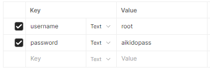
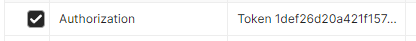
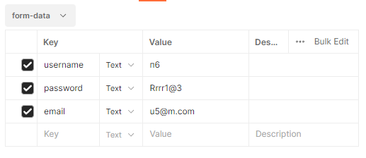
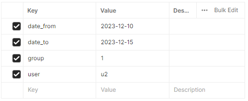
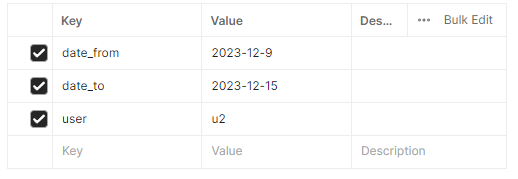

# API Endpoints

## Авторизация:

адрес: /auth/token/login/ 

запрос POST, формат form-data

username: {username}

password: {password}

ответ: json формата

    {
        "auth_token": "c30422190dc01ff8fc95f66e1a5e6b15a74da400"
    }

токен используется в заголовке Authorization для аутентификации

чтобы выйти - POST-запрос с заголовком для авторизации на /auth/token/logout/

## Создание пользователя

/api/auth/users/me/

тело запроса (form-data):

## Версии API

Адрес ресурса (кроме адресов для стандартной авторизации) начинается с api/v{номер версии}/. Старые версии не удаляются, их можно использовать на протяжении разработки.

# v1

## Профили

адрес:

/api/users/ - получение всех пользователей (только для админ-аккаунтов)

/api/users/{username}/ - получение и редактирование профиля (для не админов - только своего)

Формат:

    {
        "id": 5,
        "username": "u2",
        "first_name": "",
        "last_name": "",
        "third_name": "",
        "phone_number": 88889,
        "email": "u2@m.com",
        "birth_date": null,
        "groups": [
            1,
            3
        ]
    }

## Расписание

/api/trainings/?date_from=2023-12-08&date_to=2023-12-15 - формат запроса для получения тренировок за указанный период (рамки включительно)
возвратит все тренировки, если период не указан

Формат ответа:

    [
        {
            "id": 1,
            "date": "2023-12-09",
            "start_time": "16:00:00",
            "end_time": "17:30:00",
            "price": 300,
            "group": 1,
            "users": [
                4,
                4,
                4,
                5
            ]
        },
        {
            "id": 2,
            "date": "2023-12-09",
            "start_time": "18:00:00",
            "end_time": "20:30:00",
            "price": 400,
            "group": 1,
            "users": [
                5
            ]
        }
    ]

/api/trainings/control/ - для редактирования админами

## Группы

/api/group/{group_id}/users/ - получение всех пользователей группы

## Посещения

/api/my-attendances/?date_from=2023-12-08&date_to=2023-12-15 - формат запроса для получения своих посещений за указанный период (рамки включительно)

возвратит все посещения, если период не указан

/api/attendances/user/{user_id}/ - получение всех тренировок пользователя. Так же можно аналогично указать период

/api/attendances/ - для админов. Просмотр и редактирование записей о посещениях

# v2

## Профили - без изменений. Внесены исправления ошибок, поэтому использовать нужно v2

## Группы

адрес: groups/{id - для работы с конкретной}/

Получение списка групп, группы по id (со списком пользователей), добавление, изменение, удаление групп.

    [
        {
            "id": 1,
            "name": "testgr",
            "permissions": []
        },
        {
            "id": 2,
            "name": "1",
            "permissions": []
        },
        {
            "id": 3,
            "name": "2",
            "permissions": []
        }
    ]

#
    {
        "id": 1,
        "name": "testgr",
        "permissions": [],
        "users": [
            {
                "id": 4,
                "username": "u1",
                "first_name": "u",
                "last_name": "u",
                "third_name": "",
                "phone_number": null,
                "email": "u@m.com",
                "birth_date": null,
                "groups": [
                    1
                ]
            },
            {
                "id": 5,
                "username": "u2",
                "first_name": "",
                "last_name": "",
                "third_name": "",
                "phone_number": 88889,
                "email": "u2@m.com",
                "birth_date": "1989-11-07",
                "groups": [
                    1,
                    3
                ]
            },
            {
                "id": 7,
                "username": "u4",
                "first_name": "",
                "last_name": "",
                "third_name": "",
                "phone_number": 88889,
                "email": "u2@m.com",
                "birth_date": null,
                "groups": [
                    1,
                    3
                ]
            }
        ]
    }

## Тренировки

адрес: trainings/{id - для работы с конкретной}/

фильтры:

используются query params, например, для фильтрации по диапазону дат:

/api/v2/trainings/?date_from=2023-12-10&date_to=2023-12-15

## Посещения, оплата

адрес: attendances/{id - для работы с конкретной}/

фильтры:

